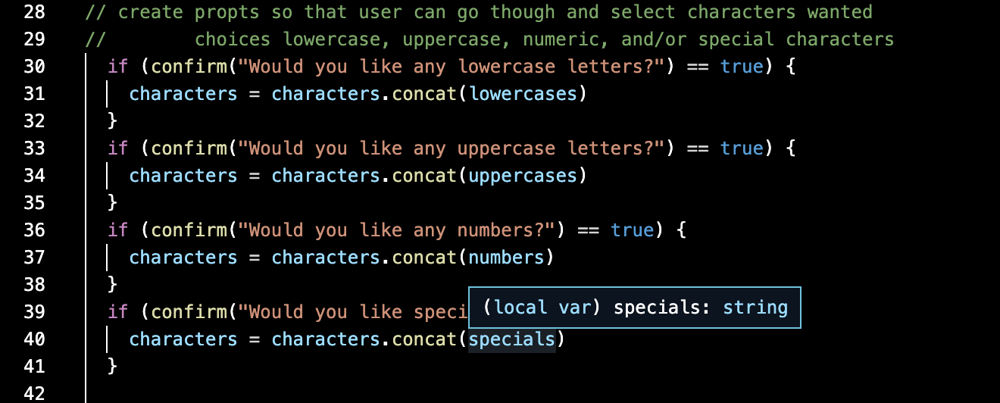

# Password Generator
​
Are you in need of new password.  If you are then you're in the right place. During this project this has been my first attempt and writing a JS script. As you will notice as you use this generator, it will give you a few options as to what type of characters you would like included or not included in your password. You can select between uppercase, lowercase, numbers and special characters. You are also give the option to select how many you would like included. You can select between 8 and 128 characters. This is the first time i have been able to try my hand at using functions, if statements and interations
​
## Screen Shot

In this section I worked on building my prompt into my if statements

## Built With
​
* [HTML](https://developer.mozilla.org/en-US/docs/Web/HTML)
* [CSS](https://developer.mozilla.org/en-US/docs/Web/CSS)
* [Javascript](https://developer.mozilla.org/en-US/docs/Web/javascript)
​
## Deployed Link
​
* [See Live Site](https://erikgustuson.github.io/password-generator-/)
​
​
## Authors
​
* Erik Gustuson 
​
- [Link to Portfolio Site](https://erikgustuson.github.io/basic-portfolio/)
- [Link to Github](https://github.com/ErikGustuson)
- [Link to LinkedIn](https://www.linkedin.com/in/erik-gustuson/)
​
## License
​

MIT License

Copyright (c) [2021] [Erik Gustuson]

Permission is hereby granted, free of charge, to any person obtaining a copy of this software and associated documentation files (the "Software"), to deal in the Software without restriction, including without limitation the rights to use, copy, modify, merge, publish, distribute, sublicense, and/or sell copies of the Software, and to permit persons to whom the Software is furnished to do so, subject to the following conditions:

The above copyright notice and this permission notice shall be included in all copies or substantial portions of the Software.

THE SOFTWARE IS PROVIDED "AS IS", WITHOUT WARRANTY OF ANY KIND, EXPRESS OR IMPLIED, INCLUDING BUT NOT LIMITED TO THE WARRANTIES OF MERCHANTABILITY, FITNESS FOR A PARTICULAR PURPOSE AND NONINFRINGEMENT. IN NO EVENT SHALL THE AUTHORS OR COPYRIGHT HOLDERS BE LIABLE FOR ANY CLAIM, DAMAGES OR OTHER LIABILITY, WHETHER IN AN ACTION OF CONTRACT, TORT OR OTHERWISE, ARISING FROM, OUT OF OR IN CONNECTION WITH THE SOFTWARE OR THE USE OR OTHER DEALINGS IN THE SOFTWARE. 
​
## Acknowledgments
​
* Thanks Adam for walking me through the tough part but not giving me the answer.